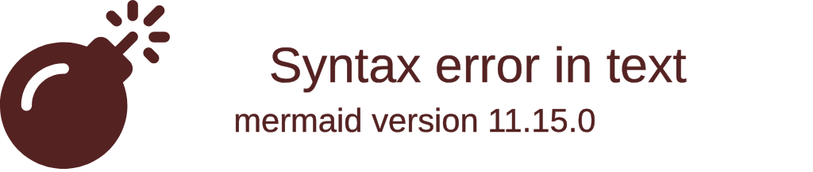
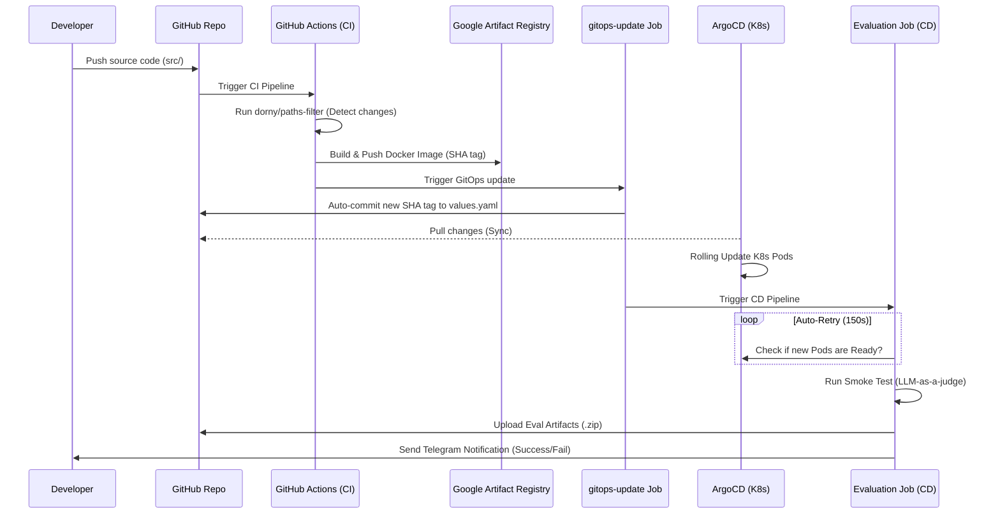
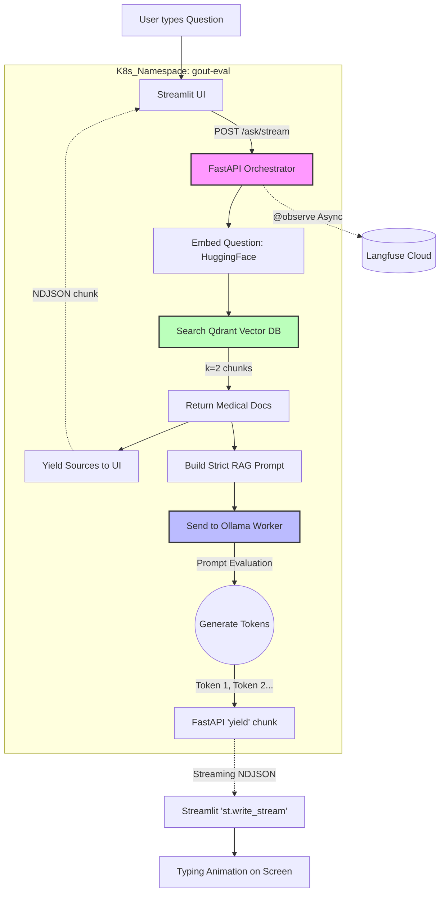

# BỘ PROMPT VÀ MÃ NGUỒN CHO AI VẼ SƠ ĐỒ (DRAW.IO / MERMAID)

Tài liệu này chứa các mô tả chi tiết bằng Tiếng Anh (chuẩn AI) và mã nguồn Mermaid để bạn có thể copy/paste trực tiếp vào tính năng AI của **Draw.io**, **Eraser.io**, hoặc **ChatUML** để sinh ra sơ đồ hệ thống tuyệt đẹp.

---

## 1. SƠ ĐỒ TỔNG QUAN KIẾN TRÚC HỆ THỐNG (System Architecture Diagram)

**Prompt cho AI Draw.io (Copy đoạn dưới đây):**
> Draw a Kubernetes Cloud-Native system architecture diagram. 
> The system is hosted on 3 Self-hosted VMs (IaaS) running Kubeadm. 
> Inside the Kubernetes Cluster, there are 4 main namespaces: 
> 1. "gout-eval" containing: Streamlit UI Pod, FastAPI Orchestrator Pod, Qdrant Vector DB Pod (with Persistent Volume), and Ollama Inference Worker Pod (placed on a specific Node labeled "worker-ai").
> 2. "argocd" containing ArgoCD controllers managing the deployments.
> 3. "monitoring" containing Prometheus and Grafana.
> External components interacting with the cluster: 
> - Users access the Streamlit UI via a LoadBalancer/NodePort.
> - GitHub Actions acts as the CI/CD pipeline, pushing images to Google Artifact Registry (GAR) and committing GitOps tags.
> - The FastAPI Orchestrator sends telemetry data (Traces/Logs) to an external SaaS called Langfuse Cloud.

**Mã Mermaid (Dùng để paste trực tiếp vào tính năng Insert > Advanced > Mermaid của Draw.io):**

---

## 2. SƠ ĐỒ CHUỖI CUNG ỨNG CI/CD VÀ GITOPS (CI/CD & GitOps Flow)

**Prompt cho AI Draw.io:**
> Draw a sequence and workflow diagram for a GitOps-based CI/CD pipeline.
> Step 1: Developer pushes code to GitHub Monorepo (branches: dev/main).
> Step 2: GitHub Actions triggers the CI Pipeline. It uses 'dorny/paths-filter' to analyze changes.
> Step 3: Based on changes, it selectively builds Docker images (UI, Orchestrator, Ingestion) and pushes them to Google Artifact Registry.
> Step 4: A Job named 'gitops-update' runs. It uses 'sed' to update the image SHA tag in 'values.yaml' and commits the change back to the Git repo.
> Step 5: ArgoCD (inside Kubernetes) detects the Git commit, pulls the new 'values.yaml', and synchronizes the Kubernetes Pods.
> Step 6: GitHub Actions CD Pipeline runs the 'Evaluation Job' (Smoke Test). It has an Auto-Retry mechanism (150s) to wait for ArgoCD to finish syncing.
> Step 7: If the Smoke Test passes (using LLM-as-a-judge), it uploads Evaluation Artifacts and sends a Telegram Notification.

**Mã Mermaid:**

---

## 3. SƠ ĐỒ LUỒNG RAG TRUY VẤN VÀ STREAMING (RAG Streaming Pipeline)

**Prompt cho AI Draw.io:**
> Draw a flowchart detailing the Retrieval-Augmented Generation (RAG) streaming process.
> 1. User types a question on the Streamlit UI.
> 2. Streamlit sends a POST request to FastAPI Orchestrator's '/ask/stream' endpoint.
> 3. FastAPI immediately embeds the question using a local HuggingFace Model.
> 4. FastAPI queries Qdrant Vector DB with Cosine Similarity (k=2).
> 5. Qdrant returns 2 relevant medical document chunks.
> 6. FastAPI yields the 'sources' metadata immediately back to Streamlit as an NDJSON chunk to prevent 120s timeouts.
> 7. FastAPI builds a strict Prompt containing the Context and Question.
> 8. FastAPI sends the prompt to the Ollama Worker (qwen2.5:1.5b) on the worker-ai Node.
> 9. Ollama processes the prompt (Prompt Evaluation) and generates tokens one by one.
> 10. FastAPI streams these tokens back to Streamlit using 'yield'.
> 11. Streamlit uses 'st.write_stream()' to display the typing animation to the User.
> Parallel process: Throughout the flow, FastAPI asynchronously sends Traces to Langfuse Cloud using a try-except block.

**Mã Mermaid:**

